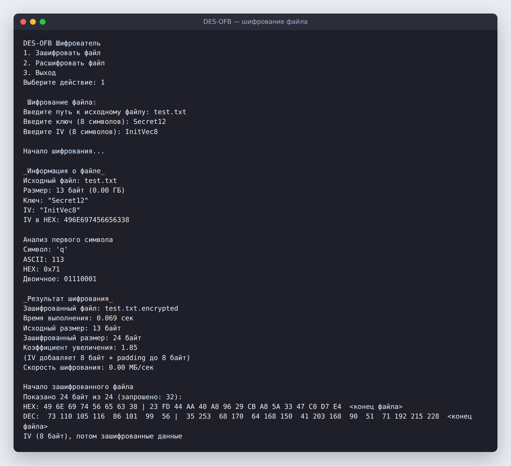
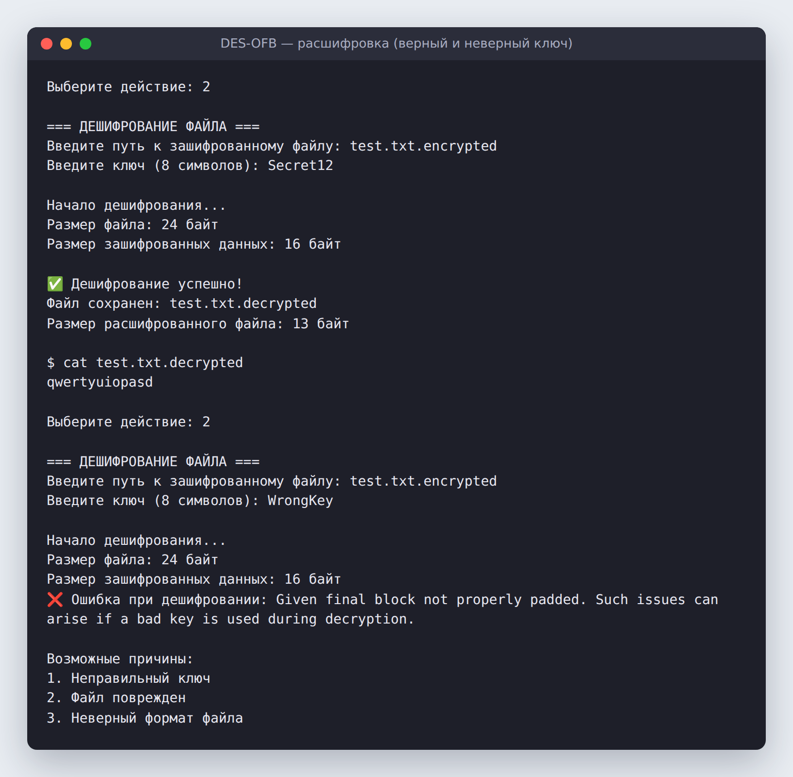

# DES-OFB: шифрование файлов

Консольная утилита на **Java** для шифрования и расшифровки файлов алгоритмом **DES** в режиме **OFB** (Output Feedback). Файлы читаются и шифруются потоково, поэтому программа справляется даже с файлами в несколько гигабайт.

Курсовая работа по информационной безопасности.


---

## Как это выглядит

**Шифрование:** программа показывает сведения о файле, разбор первого символа (ASCII, HEX, двоичный вид) и итоговую структуру зашифрованного файла



**Расшифровка:** с верным ключом исходный текст восстанавливается полностью, а на неверный ключ программа отвечает понятной ошибкой



---

## Возможности

- 🔒 **Шифрование файла** ключом и вектором инициализации (IV) длиной 8 символов
- 🔓 **Расшифровка:** IV хранится в первых 8 байтах зашифрованного файла, поэтому для расшифровки достаточно одного ключа
- ⚡ **Потоковая обработка** буфером 64 КБ: файл не загружается в память целиком, а для файлов больше 100 МБ выводится прогресс
- 📊 **Статистика:** время, скорость (МБ/с), размеры до и после шифрования и коэффициент увеличения
- 🔍 **Наглядность:** HEX- и DEC-дамп начала зашифрованного файла с разметкой, где заканчивается IV и начинаются данные
- 🧪 **Генератор тестовых файлов** (`Main.java`): создаёт файлы нужного размера со случайными данными или повторяющимся паттерном. Например, файл на 300 МБ для замера скорости

## Запуск

**Нужен** JDK 17+. Сторонние библиотеки не используются.

```bash
javac -d out src/*.java
java -cp out DESOFB        # шифратор/дешифратор
java -cp out Main          # генератор тестового файла
```

Для быстрой проверки подойдёт `test.txt` из репозитория:

1. Выбери `1` и введи путь `test.txt`, ключ и IV, например `Secret12` и `InitVec8`. Появится файл `test.txt.encrypted`.
2. Выбери `2` и введи путь `test.txt.encrypted` и ключ `Secret12`. Появится файл `test.txt.decrypted`, и его содержимое совпадёт с исходным.

> Проект сделан в учебных целях, чтобы разобраться, как устроены блочные шифры и режимы их работы. Для реальных задач нужен AES.

## 🛠️ Стек

Java · DES · режим OFB · потоковый ввод-вывод
